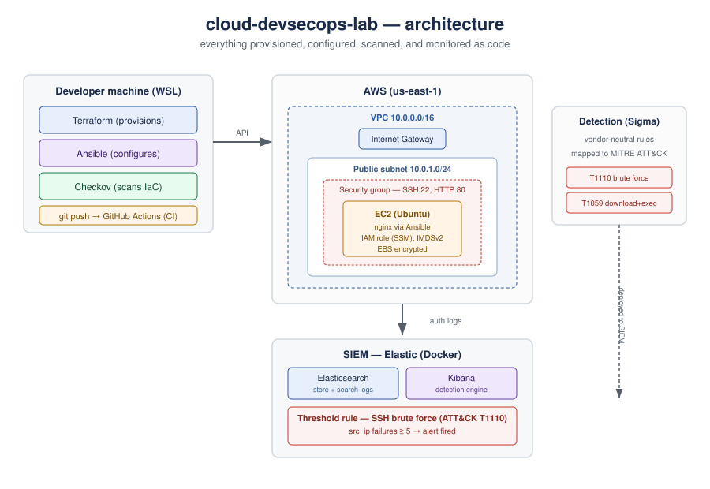

# cloud-devsecops-lab

An AWS project built entirely as code, with security and detection layered in.
Terraform provisions the infrastructure, Ansible configures it, Checkov scans it
in a CI pipeline, an IAM role replaces static keys, and detection rules — written
in Sigma and run in a real Elastic SIEM — catch attacks against the host.
Everything comes from version control, not console clicks.

Still in progress, and honest about it: the table at the bottom marks what's
actually built versus planned. Nothing gets called "done" until it works.



## What's built

**Infrastructure (Terraform).** A VPC (`10.0.0.0/16`) with a public subnet
pinned to an availability zone, an internet gateway, routing, and a default-deny
security group that only opens SSH and HTTP. An Ubuntu EC2 instance runs in it,
with the AMI looked up at plan time instead of hardcoded. Whole thing stands up
and tears down in about two minutes.

**Configuration (Ansible).** A playbook installs nginx, keeps it running, and
drops a custom page in. Terraform builds the box; Ansible decides what runs on it.

**IAM as code (Terraform).** The instance carries a least-privilege IAM role
(attached through an instance profile) with SSM access via an AWS-managed policy.
It gets temporary, rotating credentials from the metadata endpoint — which IMDSv2
protects — instead of static keys sitting on the box.

**Security scanning (Checkov).** Scanned the Terraform, then triaged the findings
instead of chasing a clean score: fixed the ones that mattered, accepted the
intentional lab choices with reasons, and ruled out the production-scale ones.
Went from 9 passing / 12 failing to 20 / 8. The real fixes were IMDSv2, EBS
encryption, the IAM role, and rule descriptions. Full triage is in
[`security/checkov-triage.md`](security/checkov-triage.md).

**CI/CD (GitHub Actions).** Every push and pull request runs the Checkov scan
automatically on a hosted runner. Soft-fail, so already-triaged findings show up
as annotations without breaking the build. The scan is enforced by the pipeline
instead of depending on remembering to run it.

**Detection engineering (Sigma + MITRE ATT&CK).** Two vendor-neutral Sigma rules
mapped to ATT&CK — SSH brute force (T1110) and download-and-execute (T1059) —
picked from current threat reporting and for actually fitting a Linux host, each
with its blind spots written down. See [`detection/`](detection/).

**SIEM (Elastic / ELK).** Took the detection work further and actually ran it:
stood up Elasticsearch + Kibana in Docker, secured it, ingested attack logs, and
built a threshold rule that **fired an alert** on a simulated SSH brute force.
That's operating a SIEM, not just writing rules on paper. See [`siem/`](siem/).

## Layout

```
main.tf                       VPC, subnet, gateway, routing, SG, EC2, IAM role
ansible/                      playbook + inventory to configure the instance
security/                     Checkov triage and raw scan output
.github/workflows/            GitHub Actions — runs Checkov on push
detection/                    Sigma rules + ATT&CK mappings and write-up
siem/                         Elastic SIEM: compose, sample logs, fired-alert proof
```

## The choices worth explaining

- **AMI looked up, not hardcoded** — hardcoded IDs go stale and differ by region.
- **Default-deny SG** — only SSH and HTTP open. SSH is open to the world here for
  lab convenience; in production that'd be a known IP, a bastion, or SSM. Checkov
  flags it; the triage doc owns the decision.
- **Public IP on purpose** — it's a single reachable lab box. Production would be
  private behind a load balancer, reached through a bastion.
- **IAM role over static keys** — temporary credentials from the IMDSv2-protected
  metadata endpoint, nothing hardcoded on the instance.
- **Destroy after each session** — IaC makes rebuilds cheap, and a zero-spend
  billing alarm backs it up.
- **No secrets in the repo** — state files, credentials, and SIEM passwords/keys
  are git-ignored or placeholdered. Keys are generated, not guessed.

## Status

| Phase | Item | Status |
|---|---|---|
| 2 | VPC, subnet, gateway, routing, SG, EC2 (Terraform) | Done |
| 2 | nginx + custom page (Ansible) | Done |
| 3 | Checkov scanning, findings triaged | Done |
| 3 | CI pipeline running the scan on push (GitHub Actions) | Done |
| 3 | IAM role as code, attached to the instance | Done |
| 3 | Sigma detection rules mapped to ATT&CK | Done |
| 3 | Detection running in a real SIEM (Elastic), alert fired | Done |
| 2 | Service in a Docker container | Planned |

## Related

Builds on [`linux-infra-lab`](https://github.com/Nicohoyoz/linux-infra-lab):
Terraform on a local container fleet, Ansible, Docker, Prometheus/Grafana. This
repo takes the same patterns to real cloud and adds security and detection.
