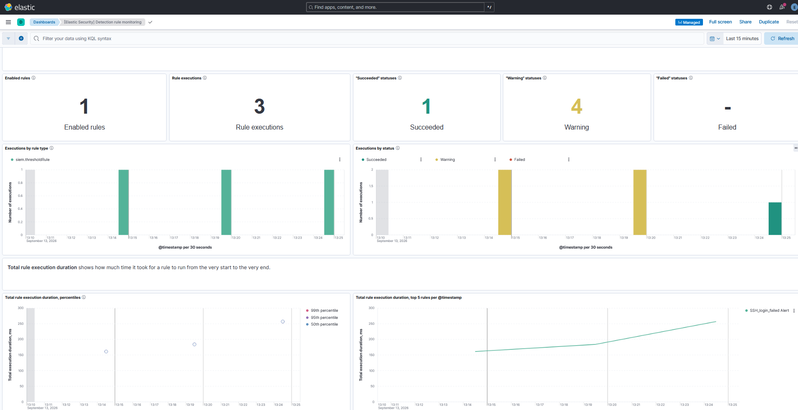

# SIEM Lab — Detection Rules in Elastic (ELK)

A local Elastic SIEM (Elasticsearch + Kibana, in Docker) for actually running
detection rules against attack logs. The Sigma rules in [`../detection/`](../detection/)
describe detection logic on paper; this is where one of them runs and fires an
alert.

**Outcome:** built a threshold rule for SSH brute force (MITRE ATT&CK T1110),
enabled it, and watched it fire on simulated traffic — 6 failed logins from one
IP. Screenshot below.

## How it fits together

```
sample auth logs ──bulk API──> Elasticsearch (stores + searches)
                                     │
                                Kibana (UI + detection engine)
                                     │
                        threshold rule runs every 5 min
                                     │
                        >5 failures from one src_ip ──> alert
```

Elasticsearch holds and searches the logs. Kibana is the UI and runs the
detection rules. Both are containers defined in `docker-compose.yml`.

## What I did

Stood up Elasticsearch and Kibana in Docker with security on — the detection
engine won't run without auth, which is the whole reason security has to be
enabled (a lab with it off can view logs but can't run rules).

Loaded sample auth logs into an `auth-logs` index over the bulk API: six failed
SSH logins from one IP (`192.168.1.100`) plus one legitimate success — a
brute-force pattern with a bit of normal traffic mixed in.

Built a threshold rule: query `event: "ssh_login_failed"`, group by
`src_ip.keyword`, fire at `>= 5`, severity High, mapped to ATT&CK T1110, runs
every 5 minutes.

Then made it actually fire. That took working through the real gotchas —
Elasticsearch needs `@timestamp` (not `timestamp`), the index name has to match
exactly, and detection rules only look at recent data so the sample logs needed
current timestamps. Once those were right, the rule ran, counted 6 failures from
one IP, and raised an alert.

## Proof



The Alerts view with the fired "SSH_login_failed Alert", High severity.

## The detection, and its limits

Same logic as the Sigma rule (`../detection/ssh-bruteforce.yml`): a lot of
failed logins from one source in a short window means brute force. Grouping by
`src_ip.keyword` and firing at 5 catches the loud single-source version. It
misses distributed attacks (spread across many IPs) and slow ones (under the
threshold) — those blind spots are written up with the Sigma rule.

## On secrets — none are in this repo

It's a local lab, but set up the right way:

- Security is on; both services require auth.
- The Kibana encryption key is generated with `openssl rand -hex 16`, not a
  guessable string. The committed `docker-compose.yml` uses placeholders —
  real passwords and the key are passed in through the environment and never
  committed. Hardcoding secrets in a public repo is the exact thing to avoid.
- In production this SIEM would live on cloud infrastructure ingesting logs from
  real EC2 instances, and alerts would page out through Slack or PagerDuty
  instead of just sitting on the Alerts page. Running it locally is the free way
  to learn the same thing.

## Running it

```bash
# set real secrets in your shell/.env first (never commit them):
#   ELASTIC_PASSWORD, the kibana password, and
#   XPACK_ENCRYPTEDSAVEDOBJECTS_ENCRYPTIONKEY  (openssl rand -hex 16)

docker compose up -d          # start Elasticsearch + Kibana
# set the kibana_system password inside Elasticsearch, restart kibana
# load sample-logs.json (refresh its timestamps to "now" first) via the bulk API
# build + enable the threshold rule in Security > Rules, watch Security > Alerts
docker compose down           # stop; the named volume keeps the data
```

Note: `sample-logs.json` has fixed timestamps, so refresh them to the current
time before loading, or the rule's recent-data window won't see them.

## Why it matters

This is the difference between writing detection rules and actually running a
SIEM — standing it up, securing it, getting logs in, writing a rule, and
confirming it fires. That last part is the job.
